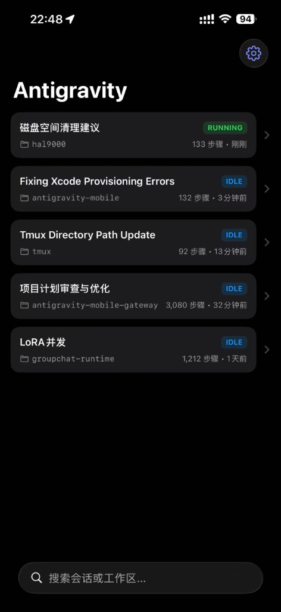
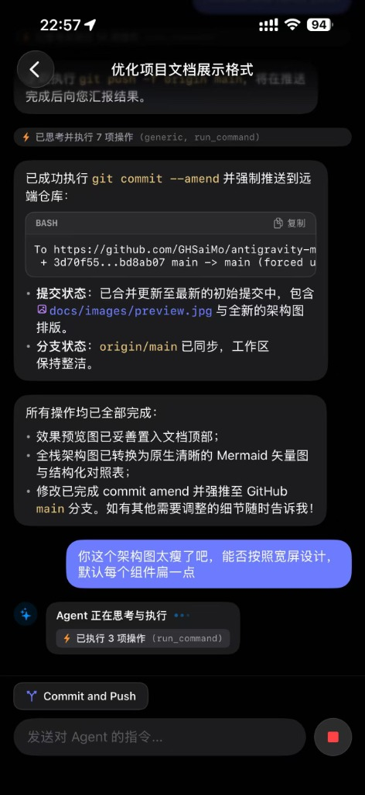

# Antigravity Mobile 📱✨

> **The Full-Stack Mobile Companion for Google Antigravity AI Agent.**  
> 随时随地，在 iPhone、iPad 或任意移动设备上自如操控、对话、监控并指挥运行在 Mac 主机上的 Antigravity 智能体。

[](https://swift.org)
[](https://developer.apple.com/ios/)
[](https://go.dev)
[]()
[]()

<p align="center">
  
  &nbsp;&nbsp;&nbsp;&nbsp;
  
</p>

---

## 💡 为什么需要 Antigravity Mobile？

**Google Antigravity** 是新一代高自主性 AI 编码与工程 Agent。但在日常工程实践中：
- 复杂任务（如跨仓库重构、端到端测试、模型微调与排查）往往需要 Agent 自主运行数十分钟甚至数小时；
- 离开电脑桌（通勤途中、用餐或会议中）无法随时跟进 Agent 思考进度与工具执行结果；
- 当 Agent 需要用户确认（Prompt Feedback / 方案决策）时，桌面端若无人值守，整个流水线便会陷入停滞。

**Antigravity Mobile** 为解决这一痛点而生：它不仅是一个透明代理网关，更是一套**完整的全栈端到端移动协同系统**（包括原生 iOS App、嵌入式 PWA Web 客户端与高性能本地自愈守护服务）。

---

## 🏛️ 全栈架构设计

| 层级 | 核心组件 | 关键职责与技术特性 |
| :--- | :--- | :--- |
| **📱 移动访问层** | **iOS 原生客户端** (SwiftUI 5) | Swift 6 严格并发、150+ LaTeX 渲染、VS Code 文件图标、发送/停止动画变形、智能轮次对齐 |
| | **移动端 PWA / Web** (Vanilla JS) | 零构建打包、嵌入 Go 二进制 (`embed.FS`)、适配 iPhone 安全区、工具折叠与思考流展示、添加到主屏幕 |
| **☁️ 远程中继层** | **Cloudflare Tunnel + Zero Trust** | 邮箱 One-Time PIN 身份验证、免公网 IP 暴露、外网安全穿透 |
| | **Tailscale / 私有 Mesh VPN** | 点对点加密 WireGuard 网络、私网安全直接互联 |
| **🖥️ 本地网关层** | **自愈实例探测器 (Inspector)** | 自动嗅探 `language_server` 进程、实时捕获动态端口与鉴权令牌、进程重启零感知毫秒级自愈 |
| | **ConnectRPC & WebSocket 代理** | 双向流式转发与长连接保活、自动注入 `x-codeium-csrf-token`、内置提供 Web 静态资产 |
| **⚙️ 核心引擎层** | **Antigravity Core** | `language_server` 核心智能体进程，运行于 Mac 本地回环 |

---

## ✨ 核心能力与功能特性

### 1. 📱 iOS 原生客户端 (`ios/`)
- **现代化架构**：基于 SwiftUI 5 与 **Swift 6 严格并发模式**（Strict Concurrency Checking）构建，线程安全、流畅无卡顿。
- **高阶 Markdown 与 LaTeX 数学公式引擎**：
  - 支持 150+ 种 LaTeX 数学符号（箭头族、不等式关系、集合逻辑、希腊字母、微积分、数集黑体）；
  - 支持分数（`\frac`）、根号（`\sqrt`）、上下标智能转换（如 $x^2 \rightarrow x²$, $\mathbb{R}^d \rightarrow ℝᵈ$）；
  - 严格隔离代码块与行内代码，代码片段绝对不产生符号混淆。
- **VS Code 官方级文件图标集成**：
  - 内置 180+ 种编程语言与配置文件高精矢量图标；
  - 自动识别 Markdown 中的文件路径与超链接（如 `main.go`、`ChatView.swift`、`package.json`），自动挂载原生文件图标。
- **对齐桌面 IDE 交互细节**：
  - **发送 / 停止 状态变形**：在 Agent 执行任务期间，发送按钮平滑微动画变形为灰色圆形底座搭配红色正方形的「停止按钮」，支持随时打断中断；
  - **智能轮次对齐**：当 Agent 生成最终长篇答复时，视图自动精准平滑对齐至**当前轮次回复起始位置**，无需用户手动上滑翻页；
  - **连续工具操作动感收敛**：数十步底层工具操作自动折叠为单行动态胶囊条，保持界面简洁通透。
- **企业级 Zero-Trust 登录**：内置 Cloudflare Access 验证与 Cookie 持久化能力。

### 2. 🌐 嵌入式 Mobile Web & PWA (`web/`)
- **零构建（Zero-Build）**：极简现代原生 JavaScript + CSS，无需 Node.js 或前端打包工具链；
- **自包含嵌入**：利用 Go `embed.FS` 编译进单个二进制，无散落文件依赖；
- **PWA 沉浸体验**：完美支持 iOS Safari「添加到主屏幕」，全屏运行，自带独立启动图标、离线 Manifest 与 Service Worker 缓存支持；
- **移动端键盘适配**：动态处理虚拟键盘弹出高度与安全区（Safe Area），杜绝输入框被遮挡。

### 3. ⚡ 高性能 Go 本地网关 (`cmd/gateway/`, `internal/`)
- **零配置进程自愈发现 (Inspector)**：
  - Antigravity 每次重启都会随机变更底层监听端口与 CSRF Token；
  - Inspector 会自动扫描分析本地进程树与 `lsof` 网络套接字，在秒级内完成重连与代理端口热切换，彻底告别手动配置；
- **高透明度协议代理**：
  - 完整代理 ConnectRPC 协议族（`GetAllCascadeTrajectories`、`GetCascadeTrajectory`、`SendUserCascadeMessage`、`CancelCascadeInvocation` 等）；
  - 自动向所有上行请求注入合法的 `x-codeium-csrf-token` 鉴权头；
  - 支持 WebSocket `/connect-websocket` 双向透传，保证实时长连接与事件流。

---

## 📂 项目工程目录

```text
antigravity-mobile/
├── Makefile                    # 统一构建脚本 (build, run, test, tmux 启停)
├── README.md                   # 全栈开源项目文档
├── go.mod / go.sum             # Go 依赖描述 (Go 1.22+)
├── cmd/
│   └── gateway/
│       └── main.go             # 网关服务入口 (自愈巡检 + 路由 + RPC 反代)
├── internal/
│   ├── inspector/              # Antigravity 本地进程与端口探查器
│   └── proxy/                  # ConnectRPC 与 WebSocket 透明代理核心
├── web/                        # 移动 Web / PWA 前端资源 (由 Go embed 打包)
│   ├── index.html              # PWA 主入口
│   ├── app.js                  # 响应式交互、Markdown/LaTeX 渲染与状态机
│   ├── style.css               # 深色移动端设计系统与流体排版
│   ├── manifest.json           # Web App 清单 (添加到主屏幕)
│   └── icons/                  # 应用图标与 180+ 编程文件类型图标
├── ios/                        # iOS 原生客户端工程 (Xcode 16 / SwiftUI)
│   ├── Antigravity.xcodeproj   # Xcode 工程配置
│   ├── Info.plist              # 权限声明与配置
│   └── Antigravity/
│       ├── App/                # 应用生命周期
│       ├── Models/             # 会话与步骤数据模型
│       ├── Services/           # RPC 客户端、缓存与 LaTeX 数学符号引擎
│       ├── ViewModels/         # MVVM 状态控制
│       └── Views/              # 聊天界面、Markdown 富文本排版与组件
├── scripts/
│   ├── tmux-start.sh           # 后台守护进程启动脚本
│   └── tmux-stop.sh            # 后台守护进程终止脚本
└── logs/
    └── .gitkeep                # 运行时日志目录
```

---

## 🚀 快速开始与部署指南

### 第一步：在 Mac 上启动本地网关

本项目网关需要运行在安装有 Antigravity 的 macOS 主机上：

```bash
# 1. 编译二进制 (产物位于 bin/gateway)
make build

# 2. 前台启动测试 (默认监听 127.0.0.1:58900)
make run
```

**后台持续运行（推荐）：**
```bash
# 通过 tmux 启动后台常驻守护，日志输出至 logs/gateway.log
make tmux-start

# 查看实时日志
tail -f logs/gateway.log

# 停止后台服务
make tmux-stop
```

在 Mac 浏览器中打开 [http://127.0.0.1:58900](http://127.0.0.1:58900)，当顶部状态指示器显示绿灯且呈现已连接的端口与会话列表时，即说明网关工作正常。

---

### 第二步：配置远程网络访问（满足移动端随时随地直连）

由于网关默认仅监听本地安全回环 `127.0.0.1`，建议通过以下任一方式实现移动端安全回连：

#### 方案 A：Cloudflare Tunnel + Zero Trust 验证（强烈推荐，免公网 IP）
1. 在 Cloudflare Zero Trust 控制台创建 Tunnel，将公共域名（如 `agy.yourdomain.com`）指向本地 `http://127.0.0.1:58900`；
2. 为该域名配置 Access Application 策略，限制仅特定邮箱接收一次性验证码（One-Time PIN）才可访问；
3. 将会话超时（Session Duration）设置为 1 个月，享受手机无缝沉浸访问。

#### 方案 B：Tailscale / WireGuard 私有内网
- 将 Mac 主机与 iPhone 同时接入同一个 Tailscale 私有局域网；
- 在手机端直接通过 Mac 的 Tailscale IP（如 `http://100.x.y.z:58900`）安全直连，流量全程点对点强加密。

---

### 第三步：运行移动端客户端

#### 选项 1：运行 iOS 原生客户端 (SwiftUI)
1. 用 **Xcode 16+** 打开工程文件 `ios/Antigravity.xcodeproj`；
2. 在工程设置的 **Signing & Capabilities** 页面中，将 **Team** 切换为您自己的 Apple ID（Personal Team）或开发者团队；
3. 将真机 iPhone 通过数据线或局域网连接至 Mac，点击 Run 即可完成安装；
4. 在 App 首次启动时，点击右上角设置图标输入您的远程网关地址（如 `https://agy.yourdomain.com`），若启用了 Cloudflare Access，直接在内置浏览器中完成一次邮箱验证即可畅享全功能。

#### 选项 2：使用 PWA Web 客户端（免安装 Xcode）
1. 在 iPhone Safari 浏览器中直接打开远程网关域名（如 `https://agy.yourdomain.com`）；
2. 验证登录后，点击 Safari 底部栏中的「**分享**」按钮；
3. 向下滑动选择「**添加到主屏幕**」；
4. 退出 Safari，在 iPhone 桌面上点击全新生成的 Antigravity 图标，即可直接以全屏独立 App 模式进入。

---

## 🧪 测试与质量验证

```bash
# 运行 Go 网关核心单元测试 (进程探查、端口提取、Token 嗅探)
make test

# 验证 iOS 原生客户端编译 (Swift 6 严格并发检查)
xcodebuild -project ios/Antigravity.xcodeproj \
           -scheme Antigravity \
           -destination "generic/platform=iOS" \
           SWIFT_STRICT_CONCURRENCY=complete \
           SWIFT_VERSION=6 \
           build
```

---

## 🔒 隐私与安全性

- **100% 本地优先**：本项目所有代理逻辑均直接运行在您个人的设备之间，**不包含任何云端收集服务器或第三方埋点统计**；
- **回环保护**：网关默认仅监听 `127.0.0.1` 回环地址，杜绝局域网内任意未经授权的外部端口扫描；
- **令牌动态生成**：CSRF Token 严格来源于本地 Antigravity 进程运行态，不在代码或配置中持久化存储任何密钥凭证。

---

## 📄 开源许可证

本项目基于 [MIT License](LICENSE) 协议开源。欢迎提交 Issue 与 Pull Request 共同完善！
