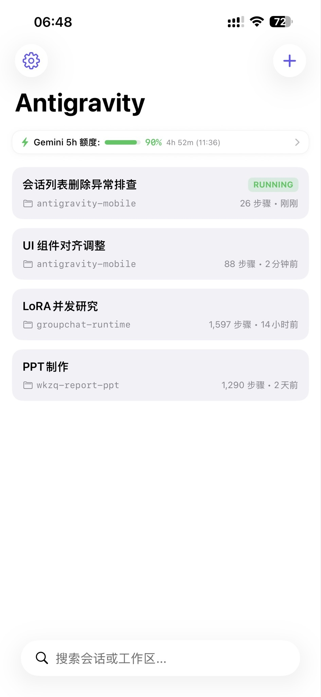
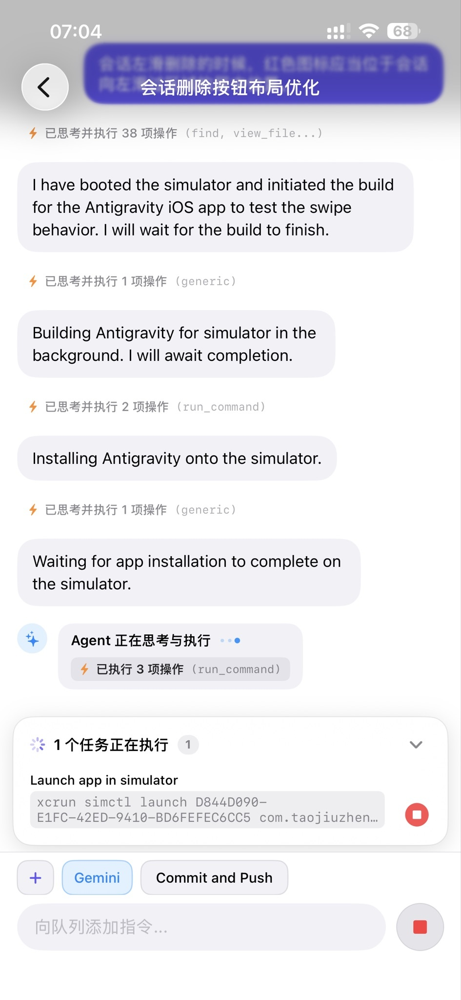

# Antigravity Mobile 📱✨

> **The Full-Stack Mobile Companion for Google Antigravity AI Agent.**  
> 随时随地，在 iPhone、iPad 或任意移动设备上自如操控、对话、监控并指挥运行在 Mac 主机上的 Antigravity 智能体。

[](https://swift.org)
[](https://developer.apple.com/ios/)
[](https://go.dev)
[]()
[]()

<p align="center">
  
  &nbsp;&nbsp;&nbsp;&nbsp;
  
</p>

---

## 💡 为什么需要 Antigravity Mobile？

**Google Antigravity** 是新一代高自主性 AI 编码与工程 Agent。但在日常工程实践中：
- 复杂任务（如跨仓库重构、端到端测试、模型微调与排查）往往需要 Agent 自主运行数十分钟甚至数小时；
- 离开电脑桌（通勤途中、用餐或会议中）无法随时跟进 Agent 思考进度与工具执行结果；
- 当 Agent 需要用户确认（Prompt Feedback / 方案决策 / 命令审批）时，桌面端若无人值守，整个流水线便会陷入停滞。

**Antigravity Mobile** 为解决这一痛点而生：它不仅是一个透明代理网关，更是一套**完整的全栈端到端移动协同系统**（包括原生 iOS App、嵌入式 PWA Web 客户端与高性能本地自愈守护服务）。

---

## 🏛️ 全栈架构设计

| 层级 | 核心组件 | 关键职责与技术特性 |
| :--- | :--- | :--- |
| **📱 移动访问层** | **iOS 原生客户端** (SwiftUI 5) | Swift 6 严格并发、单趟 O(N) LaTeX 渲染、VS Code 文件图标、Gemini 3.8 / Claude 4.6 模型切换、多模态图片上传、排队消息、后台任务监控与终止、交互式审批/Proceed 卡片、左滑删除与长按重命名、未读小蓝点、灵动岛 (Live Activity) |
| | **移动端 PWA / Web** (Vanilla JS) | 零构建打包、嵌入 Go 二进制 (`embed.FS`)、全面对齐 iOS 原生设计系统、自适应安全区与键盘防遮挡、排队消息与后台任务同步、添加到主屏幕 |
| **⚡ 远程连接与鉴权层** | **IPv6 双栈直连 (Dual-Stack Direct)** | 网关默认监听 IPv4/IPv6 全网卡，公网 IPv6 / DDNS 直连免中继，极低延迟，客户端蜂窝网络 (Cellular) 智能优先路由 |
| | **二维码扫码配对 (QR Pairing)** | 终端自动生成一次性 `agy://pair` 配对二维码，扫码秒级签发独占 Device Token，存入系统安全存储 (Keychain)，与 IP 完全解耦 |
| | **Tailscale / 私有 Mesh VPN (备选)** | 点对点加密 WireGuard 网络，无公网 IP 时安全组网互联 |
| **🖥️ 本地网关层** | **自愈实例探测器 (Inspector)** | 自动嗅探 `language_server` 进程、实时捕获动态端口与鉴权令牌、进程重启零感知毫秒级自愈 |
| | **ConnectRPC & WebSocket 代理** | 双向流式转发与长连接保活、自动注入 `x-codeium-csrf-token`、内置提供 Web 静态资产与排队追问代理 |
| | **Cockpit 配额引擎 (Cockpit Engine)** | 实时提取多账号配额数据、支持双模型 5h/Weekly 四象限监控、一键切号与脱敏遮罩 |
| | **Bark 实时推送守护 (Notification Watcher)** | 后台持续监听 Agent 状态，任务完成/失败/审批拦截/提问/Proceed 自动触发 Bark 实时推送与 DeepLink 唤醒 |
| **⚙️ 核心引擎层** | **Antigravity Core** | `language_server` 核心智能体进程，运行于 Mac 本地回环 |

---

## ✨ 核心能力与功能特性

### 1. 📱 iOS 原生客户端 (`ios/`)
- **现代化架构**：基于 SwiftUI 5 与 **Swift 6 严格并发模式**（Strict Concurrency Checking）构建，线程安全、流畅无卡顿。
- **Cockpit 额度监控与多账号看板**：
  - **首页 5h 额度状态条**：实时直观显示当前活跃模型（Gemini）5 小时额度百分比、动态进度条、剩余重置倒计时与具体时钟点（如 `⚡ Gemini 5h 额度: 90% 4h 52m (11:36) >`）；
  - **Cockpit Tools 配额抽屉**：展开后一览 Claude / Gemini 5h 与每周四项额度指标；支持多账号一键热切换与即时生效校准；内置邮箱打码遮罩（Masking）保护隐私，支持 5 分钟后台自动静默刷新与手动即时刷新。
- **双模型切换与多模态图片上传**：
  - **模型一键切换**：聊天输入栏内置 **Gemini 3.8** / **Claude 4.6** 模型快速切换胶囊，按需调用最适合的模型；
  - **多模态图片发送**：原生集成系统照片库与相机，一键上传报错截图、设计图纸或架构草图，客户端自适应轻量压缩，直接给 Agent 多模态视觉输入。
- **追问排队队列 (Queued Messages)**：
  - 当 Agent 正处于长时间思考或工具执行阶段时，支持随时发送补充指令自动进入排队队列；
  - 全宽中文化卡片式排队面板，随时查看排队指令内容或一键取消，Agent 完成当前轮次后自动按序消费。
- **后台常驻任务监控与一键终止 (Running Background Tasks)**：
  - 实时感知 Agent 在后台执行的守护进程或耗时命令；
  - 卡片式展示任务 ID、类型及运行时间，并提供红色「终止」按钮，可直接在手机上随时强制杀掉失控任务。
- **交互式审批与方案推进卡片 (Action & Proceed Cards)**：
  - 原生交互式卡片渲染：终端命令执行审批、跨目录文件读写确认、Agent 澄清提问；
  - 实施方案（Implementation Plan）就绪时，高亮展示 **Proceed** 推进按钮，手机上一键确认继续；
  - 会话列表精准标识 `RUNNING`（绿色运行中）与 `ACTION`（橙色待用户审批/推进）徽标，辅以未读小蓝点。
- **会话管理细节优化**：
  - 原生 **左滑删除**：内嵌红色居中垃圾桶图标与防误触确认弹窗，消除列表跳动；
  - 原生 **长按一步重命名**：长按卡片即刻弹出重命名输入框；
  - 全链路子代理会话过滤，自动屏蔽 Subagent 内部杂音。
- **高阶 Markdown 与 LaTeX 数学公式引擎 (单趟 O(N) 扫描)**：
  - 由原先 150+ 轮正则匹配重构为高性能单趟流式扫描解析器，杜绝长会话卡顿与掉帧；
  - 完整覆盖 150+ LaTeX 数学符号、分数（`\frac`）、根号（`\sqrt`）、上下标智能转换（如 $x^2 \rightarrow x²$, $\mathbb{R}^d \rightarrow ℝᵈ$）；严格代码块隔离。
- **VS Code 官方级文件图标集成**：
  - 内置 180+ 种主流编程语言与配置文件高精矢量图标，智能识别 Markdown 路径与链接。
- **对齐桌面 IDE 交互细节**：
  - **发送 / 停止 状态变形**：执行期间平滑变形为停止按钮；
  - **智能轮次对齐**：长篇答复自动对齐至当前轮次起始位置；
  - **多步工具折叠**：自动收敛为动态胶囊条。
- **扫码秒级配对与安全认证**：
  - 内置扫码器直接扫描终端配对二维码，一键获取独占 Device Token 并保存至系统 Keychain；
  - 优先走蜂窝网络直连 (Cellular Priority)，无缝降级 Wi-Fi / VPN。

### 2. 🔔 实时通知推送与 DeepLink (Bark 集成)
- **全自动化智能推送**：无需保持 App 前台，网关后台 Watcher 持续巡检：
  - 任务顺利完成推送（`🎉 Antigravity 任务已完成`，附带步骤数统计）；
  - 异常报错中断推送（`❌ Antigravity 任务执行失败`）；
  - 关键审批提醒推送（`⚠️ Antigravity 需要审批`：命令执行、文件改动等）；
  - 方案就绪推送（`📋 方案已就绪，等待确认`，提示点击 Proceed）；
  - 追问与提问推送（`❓ Antigravity 提问`）。
- **DeepLink 毫秒直达**：点击 iOS 锁屏/横幅通知直接打开对应会话（`antigravity://session/<id>`），立刻审批或继续对话。
- **开箱即用**：只需在 `.env` 中配置 `BARK_URL` 即可立即激活，支持自定义警报提示音（如 alarm、glass）与通知分组。

### 3. 🌐 嵌入式 Mobile Web & PWA (`web/`)
- **零构建（Zero-Build）**：极简现代原生 JavaScript + CSS，无需 Node.js 或前端打包工具链；
- **自包含嵌入**：利用 Go `embed.FS` 编译进单个二进制，无散落文件依赖；
- **全端对齐原生设计**：全面对齐 iOS 原生客户端视觉与交互风格，包含深色现代卡片、排队追问卡片、后台任务控制条与交互审批流；
- **PWA 沉浸体验**：完美支持 iOS Safari「添加到主屏幕」，全屏运行，自带独立启动图标、离线 Manifest 与 Service Worker 缓存支持；
- **移动端键盘适配**：动态处理虚拟键盘弹出与收起高度，消除键盘收起黑边与页面跳动，安全区完全适配。

### 4. ⚡ 高性能 Go 本地网关 (`cmd/gateway/`, `internal/`)
- **零配置进程自愈发现 (Inspector)**：
  - Antigravity 每次重启都会随机变更底层监听端口与 CSRF Token；
  - Inspector 会自动扫描分析本地进程树与网络套接字，在秒级内完成重连与代理端口热切换，彻底告别手动配置；
- **高透明度协议代理**：
  - 完整代理 ConnectRPC 协议族（`GetAllCascadeTrajectories`、`GetCascadeTrajectory`、`SendUserCascadeMessage`、`CancelCascadeInvocation` 等）；
  - 自动向所有上行请求注入合法的 `x-codeium-csrf-token` 鉴权头；
  - 支持 WebSocket `/connect-websocket` 双向透传，保证实时长连接与事件流。
- **IPv6 双栈监听与安全配对**：
  - 默认绑定 IPv4 与 IPv6 全网卡（`:58900`），支持公网 IPv6 / DDNS 域名直连；
  - 启动时终端输出一次性配对二维码；
  - 签发应用层独占凭证（Device Token），存入 `~/.antigravity-mobile/auth_store.json`，支持设备管理；
  - 可选 HTTPS/TLS 证书支持（`--tls-cert` / `--tls-key`）。

---

## 📂 项目工程目录

```text
antigravity-mobile/
├── Makefile                    # 统一构建脚本 (build, run, test, tmux 启停)
├── README.md                   # 全栈开源项目文档
├── env.example                 # 环境配置模板 (Bark 推送、端口等)
├── images/                     # 项目文档截图与预览图
│   ├── session_list.jpg        # 移动端主界面与配额监控预览图
│   └── native_components.jpg   # 原生交互组件与后台任务监控预览图
├── go.mod / go.sum             # Go 依赖描述 (Go 1.22+)
├── .github/workflows/ci.yml    # CI/CD 自动化工作流
├── cmd/
│   └── gateway/
│       └── main.go             # 网关服务入口 (自愈巡检 + 路由 + RPC 反代)
├── internal/
│   ├── auth/                   # 设备认证、扫码配对、Token 管理与持久化
│   ├── cockpit/                # Cockpit 配额监控、多账号切换与数据提供器
│   ├── config/                 # .env 配置加载与通知参数解析
│   ├── inspector/              # Antigravity 本地进程与端口探查器
│   ├── notifier/               # Bark 实时推送、DeepLink、后台任务巡检器 (Watcher)
│   └── proxy/                  # ConnectRPC、WebSocket、排队消息与后台任务代理核心
├── web/                        # 移动 Web / PWA 前端资源 (由 Go embed 打包)
│   ├── index.html              # PWA 主入口
│   ├── app.js                  # 响应式交互、Markdown/LaTeX 渲染与状态机
│   ├── style.css               # 移动端现代设计系统与流体排版
│   ├── manifest.json           # Web App 清单 (添加到主屏幕)
│   └── icons/                  # 应用图标与 180+ 编程文件类型图标
├── ios/                        # iOS 原生客户端工程 (Xcode 16 / SwiftUI 5)
│   ├── Antigravity.xcodeproj   # Xcode 工程配置
│   ├── Info.plist              # 权限声明与配置
│   └── Antigravity/
│       ├── ActivityExtension/  # 灵动岛与实时活动 (Live Activity)
│       ├── App/                # 应用生命周期
│       ├── Models/             # 会话、步骤、配额、排队消息、后台任务模型
│       ├── Services/           # RPC 客户端、WebSocket、扫码配对、Keychain、单趟 LaTeX 引擎
│       ├── ViewModels/         # MVVM 状态控制
│       └── Views/              # 会话列表、聊天界面、配额看板、扫码配对、卡片式交互
├── scripts/
│   ├── tmux-start.sh           # 后台守护进程启动脚本
│   └── tmux-stop.sh            # 后台守护进程终止脚本
└── logs/
    └── .gitkeep                # 运行时日志目录
```

---

## 🚀 快速开始与部署指南

### 第一步：在 Mac 上启动本地网关

本项目网关需要运行在安装有 Antigravity 的 macOS 主机上：

```bash
# 1. 复制环境配置文件 (配置 Bark 推送等，可选)
cp env.example .env

# 2. 编译二进制 (产物位于 bin/gateway)
make build

# 3. 前台启动测试 (默认监听 :58900，终端自动打印配对二维码)
make run
```

**后台持续运行（推荐）：**
```bash
# 通过 tmux 启动后台常驻守护，日志输出至 logs/gateway.log
make tmux-start

# 查看实时日志与配对二维码
tail -f logs/gateway.log

# 停止后台服务
make tmux-stop
```

在 Mac 浏览器中打开 [http://127.0.0.1:58900](http://127.0.0.1:58900)，当顶部状态指示器显示绿灯且呈现已连接的端口与会话列表时，即说明网关工作正常。

---

### 第二步：配置远程网络访问（满足移动端随时随地直连）

网关默认绑定 IPv4 与 IPv6 全网卡（`:58900`），支持多种免公网 IPv4 的远程直连方式：

#### 方案 A：IPv6 / DDNS 公网直连（强烈推荐，超低延迟）
1. 绝大多数家庭宽带与移动网络均已原生分配公网 IPv6 地址；
2. 配合 DDNS（如将 DDNS 域名绑定到 Mac 网卡 IPv6），并在启动时传入 `-ddns <your-ddns-domain>` 或配置环境变量 `DDNS_HOST`；
3. 网关在终端打印的配对二维码将自动携带公网域名，iPhone 无论处于 5G 蜂窝网络还是外部 Wi-Fi，均可直接秒级直连，无任何第三方中转延迟。

#### 方案 B：Tailscale / WireGuard 私有内网
- 将 Mac 主机与 iPhone 同时接入同一个 Tailscale 私有局域网；
- 在手机端直接通过 Mac 的 Tailscale IP（如 `http://100.x.y.z:58900`）安全直连，流量全程点对点强加密。

#### 方案 C：本地局域网 (Wi-Fi)
- 手机与 Mac 处于同一 Wi-Fi 网络下，直接通过 Mac 局域网 IP（如 `192.168.x.x:58900`）直连。

---

### 第三步：配置 iOS Bark 实时推送通知（可选，强烈推荐）

想要离开电脑桌后，在 Agent **任务完成**、**遇到异常** 或 **等待审批/Proceed 确认** 时立刻收到手机推送？

1. 在 iPhone App Store 搜索安装 **Bark**（认准开发者 Finb / 伍峰 的极简纯色图标应用）；
2. 打开 Bark 复制你的专属链接（如 `https://api.day.app/YOUR_DEVICE_KEY/`）；
3. 打开 `.env` 文件，填入 `BARK_URL`：
   ```env
   BARK_URL=https://api.day.app/YOUR_DEVICE_KEY/
   ```
4. 重启网关，推送服务即刻生效！手机收到推送点击即可直达对应会话。

---

### 第四步：运行移动端客户端

#### 选项 1：运行 iOS 原生客户端 (SwiftUI)
1. 用 **Xcode 16+** 打开工程文件 `ios/Antigravity.xcodeproj`；
2. 在工程设置的 **Signing & Capabilities** 页面中，将 **Team** 切换为您自己的 Apple ID（Personal Team）或开发者团队；
3. 将真机 iPhone 连接至 Mac，点击 **Run** 即可完成安装；
4. 在 App 首次启动时，点击右上角扫码图标直接扫描 Mac 终端打印的配对二维码，即可自动完成设备 Token 交换并安全直连！

#### 选项 2：使用 PWA Web 客户端（免安装 Xcode）
1. 在 iPhone Safari 浏览器中直接打开网关域名或 IP（如 `http://mac.yourdomain.com:58900`）；
2. 登录/配对后，点击 Safari 底部栏中的「**分享**」按钮；
3. 向下滑动选择「**添加到主屏幕**」；
4. 退出 Safari，在 iPhone 桌面上点击全新生成的 Antigravity 图标，即可直接以全屏独立 App 模式进入。

---

## 🧪 测试与质量验证

```bash
# 运行 Go 网关核心单元测试 (进程探查、端口提取、Token 嗅探、配额解析、通知推送)
make test

# 验证 iOS 原生客户端编译 (Swift 6 严格并发检查)
xcodebuild -project ios/Antigravity.xcodeproj \
           -scheme Antigravity \
           -destination "generic/platform=iOS" \
           SWIFT_STRICT_CONCURRENCY=complete \
           SWIFT_VERSION=6 \
           build
```

---

## 🔒 隐私与安全性

- **100% 本地优先**：本项目所有代理逻辑均直接运行在您个人的设备之间，**不包含任何云端收集服务器或第三方埋点统计**；
- **设备级独立凭据**：通过二维码配对签发高强度独占 Device Token，存储在 iOS 系统级 Keychain 中，支持随时在网关撤销设备；与手机网络 IP 彻底解耦，无惧 5G/Wi-Fi 切换与 IPv6 临时地址漂移；
- **安全隔离与动态注入**：CSRF Token 严格来源于本地 Antigravity 进程运行态，不在代码或配置中持久化存储任何密钥凭证，自动完成上行鉴权注入；
- **可选端到端 TLS 加密**：支持通过 `--tls-cert` 与 `--tls-key` 启用 HTTPS / WSS 加密传输。

---

## 📄 开源许可证

本项目基于 [MIT License](LICENSE) 协议开源。欢迎提交 Issue 与 Pull Request 共同完善！
