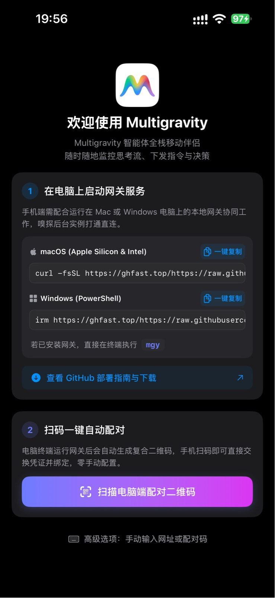
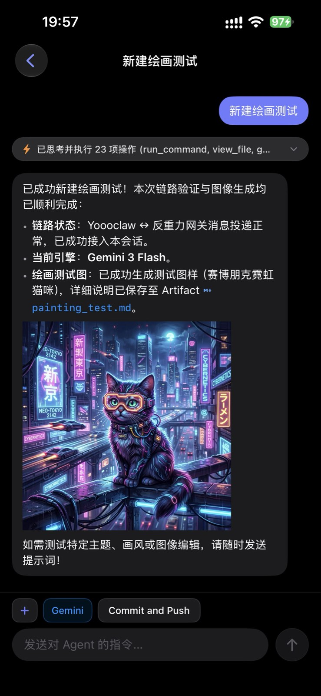
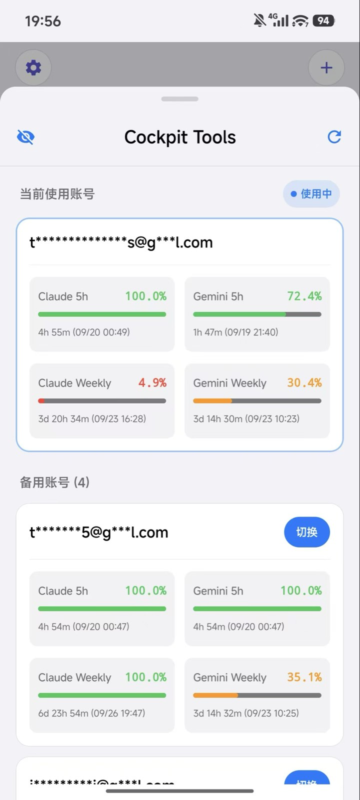
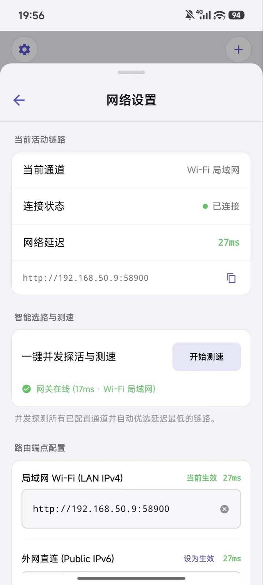

# Multigravity 📱✨

> **The Full-Stack Mobile & Remote Companion for Google Antigravity AI Agent.**  
> 随时随地，在 Android、iPhone、iPad 或任意移动设备上自如操控、实时对话、监控配额并指挥运行在电脑上的 Antigravity 智能体。  
> 
> *代码仓库保持为 `antigravity-mobile`，产品对外正式品牌命名为 **Multigravity**，全局命令行工具为 **`mgy`**。*

[](https://github.com/GHSaiMo/antigravity-mobile/releases/latest)
[](https://github.com/GHSaiMo/antigravity-mobile/releases/latest)
[](https://github.com/GHSaiMo/antigravity-mobile/releases/latest)
[](https://github.com/GHSaiMo/antigravity-mobile/releases/latest)
[](https://kotlinlang.org)
[](https://swift.org)
[](https://go.dev)
[](LICENSE)

<p align="center">
  
  &nbsp;&nbsp;&nbsp;&nbsp;
  
</p>
<p align="center">
  
  &nbsp;&nbsp;&nbsp;&nbsp;
  
</p>

---

## ⚡ 极速开始 (v1.0.1 正式版)

### 1. 🍎 macOS / 🪟 Windows 服务端一键安装 (推荐)

一键安装指令**支持全自动根据操作系统与架构自适应下载匹配的二进制包**（**免翻墙免代理，秒级全自动完成部署**）：

#### 🍎 macOS / 🪟 Windows (Git Bash / MSYS) 用户：
打开终端，直接执行：
```bash
# 国内网络加速一键安装（默认推荐）
curl -fsSL https://ghfast.top/https://raw.githubusercontent.com/GHSaiMo/antigravity-mobile/main/scripts/install.sh | bash
```

<details>
<summary><b>🌐 海外或已配置终端代理用户（GitHub 官方源）</b></summary>

```bash
curl -fsSL https://raw.githubusercontent.com/GHSaiMo/antigravity-mobile/main/scripts/install.sh | bash
```
</details>

#### 🪟 Windows (PowerShell / Windows Terminal) 用户：
打开 PowerShell，直接执行：
```powershell
# 国内网络加速一键安装（默认推荐）
irm https://ghfast.top/https://raw.githubusercontent.com/GHSaiMo/antigravity-mobile/main/scripts/install.ps1 | iex
```

<details>
<summary><b>🌐 海外或已配置终端代理用户（GitHub 官方源）</b></summary>

```powershell
irm https://raw.githubusercontent.com/GHSaiMo/antigravity-mobile/main/scripts/install.ps1 | iex
```
</details>

> **智能安装特性**：
> - 🖥️ **跨平台自适应**：自动识别 **macOS**（Apple Silicon M系列 / Intel）与 **Windows**（x86_64），精准下载对应系统的 **~7MB 单架构极简包**；
> - ⚡ **自适应本地代理**：自动探测本机活跃代理（Clash: 7890、V2Ray: 10808、Surge: 6152 等），无需手动 export；
> - 🚀 **镜像双保险**：无代理或直连受阻时，秒级无缝降级至国内加速节点；
> - 🔒 **平滑部署**：macOS 免 sudo 部署至 `~/.local/bin/mgy`；Windows 自动注册至用户 PATH 及 WindowsApps 目录，开箱即用免重启终端。

### 2. 📱 Android 手机客户端安装
前往 [GitHub Releases v1.0.1](https://github.com/GHSaiMo/antigravity-mobile/releases/latest)，下载：
- **`Multigravity-v1.0.1.apk`**
- *安装包已配置标准签名，任何安卓手机下载后均可直接点击安装，零编译门槛。*

### 3. 🔑 启动服务与扫码配对
在终端（macOS / Windows PowerShell / CMD）中直接运行：
```bash
mgy
```
网关前台启动后会**在终端直接打印一次 ASCII 配对二维码**。打开手机上的 Multigravity App，扫描终端二维码，即可瞬间连通！

---

## 🛠️ 常用 CLI 指令 (`mgy`)

网关已收敛为纯 Go 单一二进制工具，内置毫秒级响应的原生管理子命令（彻底摆脱外部脚本与 Python 依赖）：

```bash
mgy                # 前台启动网关主服务，双栈监听并打印一次配对二维码
mgy run            # 等同于直接运行 mgy，支持传入自定义参数 (如 -port 58900)
mgy pair           # 向正在运行的网关申请并打印 5 分钟有效的新配对二维码与链接
mgy list           # 查看所有已配对授权的移动设备 (支持在线与离线查看)
mgy clear all      # 一键清除所有已配对设备授权
mgy clear <dev_id> # 清除指定设备授权
mgy version        # 查看当前网关版本信息
mgy help           # 查看完整命令与启动参数帮助
```

> 📖 **进阶维护指南**：
> 完整安装机制、多场景本地自测（架构匹配 / 纯净首次安装 / IPv6 自动修复 / 5G 直连排错）与一键卸载方案，详见 ➔ [**安装、本地自测与卸载运维指南 (docs/installation_and_testing_guide.md)**](docs/installation_and_testing_guide.md)。

---

## 💡 为什么需要 Multigravity？

**Google Antigravity** 是新一代高自主性 AI 编码与工程智能体。但在日常工程实践中：
- 复杂任务（如跨仓库大规模重构、端到端自动化测试、深度架构推导）往往需要 Agent 自主运行数十分钟甚至数小时；
- 离开电脑桌（通勤途中、用餐或会议中）无法随时跟进 Agent 思考进度与工具执行结果；
- 当 Agent 需要用户确认（Prompt Feedback / 方案决策 / 命令审批）时，桌面端若无人值守，整个流水线便会陷入停滞。

**Multigravity** 为解决这一痛点而生：它不仅是一个透明代理网关，更是一套**完整的全栈端到端移动与外设协同系统**——涵盖原生 Android App（Jetpack Compose）、原生 iOS App（SwiftUI 5 / Swift 6）、极简自嵌入 PWA Web 客户端、随身外设硬件联动网桥，以及具备进程自愈、端到端 TLS 域名中继和跨端活跃游标感知的 Go 本地服务。

---

## 🏛️ 全栈架构设计

| 层级 | 核心组件 | 关键职责与技术特性 |
| :--- | :--- | :--- |
| **📱 移动访问层** | **Android 原生客户端** (Compose) | **全功能旗舰体验**：Kotlin 1.9+、Jetpack Compose Material 3 纯黑美学、Edge-to-Edge 全面屏沉浸显示、IME 软键盘自适应防遮挡与聚焦触底平滑滚动；OkHttp + WebSocket 实时打字机流分发、多步工具折叠胶囊；**多模态生图直出渲染**与 `ImageViewerSheet` 全手势大图缩放；**网络设置一键并发探活测速与智能路由选路**；**Cockpit Tools 四象限配额看板与多账号池无感热切**；方案产物原生浮窗 (Markdown / PPTX 幻灯片渲染 / Brain 元数据逆向解析 / 本地一键下载导出) 与 Proceed 推进闭环；**消息撤回与代码修改方案回滚**；排队追问面板、后台任务感知与终止、工程快捷动作胶囊、ZXing 离线二维码秒级配对、`EncryptedSharedPreferences` 硬件密钥持久化、全态分类信号 |
| | **iOS 原生客户端** (SwiftUI 5) | **Swift 6 严格并发**：零数据竞态、丝滑流畅；单趟 O(N) LaTeX 渲染、Markdown 富媒体与多模态生图直出、`ImageViewerSheet` 双指捏合无级缩放与系统分享保存；方案产物浮窗与 Proceed 闭环；统一文件预览工具栏与 PPTX 幻灯片渲染；**Cockpit Tools 四象限额度看板与多账号热切**；**网络设置一键并发探活与智能选路**；**消息撤回与代码修改回滚**（毛玻璃材质浮窗）；排队追问队列与自适应输入；交互式命令审批卡片；交互式侧滑返回（Swipe-Back）原生手势体验；全态分类信号 (`RUNNING` / `ERROR` / `ACTION` / 未读呼吸小蓝点)；0ms 会话焦点上报、灵动岛 (Live Activity) |
| | **移动端 PWA / Web** (Vanilla JS) | 零构建打包、嵌入 Go 二进制 (`embed.FS`)、全面对齐 iOS 原生设计系统与 NavigationStack 导航、列表滚动/侧滑手势消抖（防误触进入）、居中对称标题与 38px 悬浮垃圾桶删除、自适应安全区与键盘防遮挡、Markdown 浮窗与方案 Proceed 推进、排队消息与后台任务同步、添加到主屏幕 |
| **🎯 跨端游标与焦点层** | **随人而动游标引擎 (Follow-Me Cursor Engine)** | 毫秒级多端焦点仲裁：活跃长连接流 (Active Stream) > 移动端黏性焦点 (Mobile Sticky 30m) > 桌面端 IDE 活跃焦点 (Desktop Focus) > 磁盘最后活跃会话兜底；提供 0ms 会话焦点上报与预热；防自反保护机制 (Anti-Reflection 1.5s 抑制期) 彻底消除已读回环误判；幽灵会话三重防御过滤 |
| **🦞 物理外设网桥层** | **YoooClaw 物理硬件网桥 (`integrations/yoooclaw/`)** | 随身外设按键录音 ➔ ASR ➔ Gateway-First 代理直连注入活跃 Cascade 会话；双层协同分流（第一层 Hermes 业务守卫放行，第二层统一游标精准定位目标会话）；四色交织 RGB 流光动效与 OLED 屏幕状态回显 |
| **⚡ 远程连接与鉴权层** | **智能路由与一键并发测速 (Smart Multi-Channel Routing)** | 移动端动态管理 Wi-Fi 局域网 (LAN IPv4)、外网直连 (Public IPv6) 与云端中继 (FRP / DDNS)；提供一键并发探活，秒级测速回显并自动优选延迟最低链路，支持客户端手动动态切换端点 |
| | **HTTPS 域名中继与端到端 TLS 1.3** | 支持公网域名直连或通过 FRP 隧道穿透配合 Let's Encrypt 证书 (`scripts/issue-agy-tls.sh`)，实现无公网 IPv4 下的域名安全中继；配对二维码优先携带安全 HTTPS 链接 (`ssl=1`)，Mac/PC 本地终止解密，VPS 仅透明转发 TCP 密文，手机端无缝绕过 iOS ATS 拦截并启用 HSTS |
| | **IPv6 双栈直连 (Dual-Stack Direct)** | 网关默认监听 IPv4/IPv6 全网卡，公网 IPv6 / DDNS 直连免中继，极低延迟，客户端蜂窝网络 (Cellular) 智能优先路由 |
| | **二维码扫码配对 (QR Pairing)** | 终端或 `mgy pair` 自动生成一次性 `agy://pair` 配对二维码，扫码秒级签发独占 Device Token，存入系统安全存储 (Keychain / EncryptedSharedPreferences)，与 IP 完全解耦；支持高级手动大小写不敏感配对 |
| | **Tailscale / 私有 Mesh VPN (备选)** | 点对点加密 WireGuard 网络，无公网 IP 时安全组网互联 |
| **🖥️ 本地网关层** | **自愈实例探测器 (Inspector)** | **原生支持 macOS 与 Windows**：深度逆向自动嗅探各平台 `language_server` 进程、实时捕获动态端口与鉴权令牌、进程重启零感知毫秒级自愈；离线状态具备指数退避 (5s→10s→20s→40s) 防 CPU 空转 |
| | **ConnectRPC & WebSocket 代理** | 双向流式转发与长连接保活、自动注入 `x-codeium-csrf-token`、免二次编码大图透传优化 (`needsModification`)、单 IP 60次/分 WS Ticket 限流加固、安全沙箱文件代理 (`/api/v1/files/content`) 与 Brain 伴生元数据解析、内置提供 Web 静态资产与排队追问代理 |
| | **Cockpit 配额引擎 (Cockpit Engine)** | 实时提取多账号配额数据、支持双模型 5h/Weekly 四象限监控与精准重置时间倒计时、多账号池一键无感热切与邮箱脱敏遮罩 |
| | **Bark 实时推送守护 (Notification Watcher)** | 后台持续监听 Agent 状态，任务完成/失败/审批拦截/提问/Proceed 自动触发 Bark 实时推送与 DeepLink 唤醒 |
| **⚙️ 核心引擎层** | **Antigravity Core** | `language_server` 核心智能体进程，运行于 Mac 或 Windows 本地回环 |

---

## ✨ 核心能力与功能特性

### 1. 🧭 开箱即用与跨平台秒级配对 (Onboarding Guide & QR Pairing)
- **单页紧凑型引导设计**：对齐 iOS / Android 双端视觉，首次启动或重新配对呈现极简两步式操作；
- **跨平台一键安装指令**：macOS (Apple Silicon & Intel) 与 Windows (PowerShell) 一键部署命令直接一键复制，支持横向防折叠滚动展示；若已安装网关，直接提示终端执行 `mgy`；
- **扫码一键自动配对**：电脑终端前台运行网关后自动生成复合 ASCII 二维码，手机端打开扫码器秒级捕获并完成凭据交换与设备绑定，零手动配置；
- **高级手动配对选项**：支持手动输入网关 URL 或 6 位配对码，支持大小写不敏感容错校验，全展开抽屉自适应软键盘防遮挡。

---

### 2. ⚡ 多通道网络管理、一键并发探活与智能选路 (Smart Routing & Probing)
- **多通道端点统一管理**：移动端「网络设置」面板直观管理局域网 Wi-Fi (LAN IPv4)、外网直连 (Public IPv6) 与云端域名/FRP 穿透中继；
- **一键并发探活与测速**：点击「开始测速」，毫秒级并发探测所有已配置通道的连通性与往返延迟（如 `17ms · Wi-Fi 局域网` / `27ms · 外网直连`）；
- **智能自动选路机制**：并发探测后自动优选并平滑切换至延迟最低的通道，确保通勤移动与跨网场景下长连接不中断；
- **手动路由控制**：支持在路由端点列表中点击「设为生效」手动指定目标链路，实时呈现连接状态指示灯与当前生效延迟。

---

### 3. 📊 Cockpit Tools 配额罗盘与多账号池无感热切 (Account Pool & Quota Engine)
- **动态 Quota 状态条 (`QuotaStatusBar`)**：首页顶部常驻实时额度状态条，一眼掌握核心配额健康度；
- **全方位四象限配额看板**：全景监控当前使用账号的 **Claude 5h、Gemini 5h、Claude Weekly、Gemini Weekly** 四象限配额百分比，精确显示额度恢复与重置倒计时（精确到分/秒，如 `4h 55m (09/20 00:49)`、`3d 20h 34m`）；
- **备用账号池管理**：支持展示与维护多个备用账号，一键点击「切换」按钮即可在移动端完成热切换（Hot-switching），无需重新登录与退出；
- **隐私保护与实时刷新**：支持邮箱脱敏遮罩展示（支持一键眼睛图标切换隐藏明文），支持手动添加新账号与一键实时刷新配额。

---

### 4. 🎨 实时流式会话、多模态绘图与富媒体产物闭环 (Multimodal & Artifacts)
- **实时打字机流式长连接**：基于 **OkHttp 4.12 + WebSocket**（Android）与 **URLSession WebSocket**（iOS）驱动流式响应，支持断网重连与状态同步；
- **多步工具折叠胶囊 (`ToolStepCollapseCard`)**：自动聚合长串工具调用与思考流为轻量胶囊条（如 `⚡ 已思考并执行 23 项操作 (run_command, view_file, g...)`），杜绝刷屏卡顿，点击即可展开查看详情；
- **多模态绘图直出原生渲染**：深度支持图像生成工具直出（如赛博朋克霓虹猫咪等高质量大图），直接在会话流中高质量渲染；
- **全屏手势级大图查看器 (`ImageViewerSheet`)**：点击会话内任意图片即可进入沉浸式查看器，支持双击缩放、双指捏合无级缩放、自由平移拖拽、保存至相册与系统分享；
- **方案产物浮窗与 Proceed 推进闭环**：会话内 Markdown 链接即刻展开原生浮窗，逆向解析 Brain 伴生元数据摘要，底部常驻 Proceed 一键推进闭环；
- **PPTX 幻灯片原生渲染与下载**：原生支持幻灯片文档预览，提供统一文件预览工具栏并支持本地一键下载导出。

---

### 5. ⏪ 消息撤回与代码修改方案回滚 (Message Undo & Revert)
- **用户指令一键撤回**：会话中支持对最近发送的指令一键撤回（Undo），并自动还原至输入框草稿置顶排序，方便快速编辑与重新提问；
- **代码修改方案回滚**：关联代码修改时提供方案回滚预览，搭配毛玻璃磨砂质感浮窗与原生材质胶囊按钮，保障操作安全。

---

### 6. 📱 双旗舰原生移动端深度体验打磨 (Android & iOS)
- **Android 原生客户端 (`android/`)**：
  - 基于 **Kotlin 1.9+** 与 **Jetpack Compose Material 3** 暗黑美学；
  - **Edge-to-Edge 全面屏沉浸显示**：完美消除多任务切换与底部手势条黑边；
  - **输入体验优化**：软键盘 IME Insets 防遮挡，输入框聚焦时自动平滑滚动至会话最底；
  - **新建会话抽屉 (`NewConversationSheet`)**：支持工作区选择与纯对话模式（Pure Chat）。
- **iOS 原生客户端 (`ios/`)**：
  - 基于 **SwiftUI 5** 与 **Swift 6 严格并发模式**（Strict Concurrency Checking），零数据竞态；
  - **原生手势修复**：全面恢复交互式侧滑返回（Swipe-Back）手势，消除进出会话时的抖动与高度跳跃；
  - **单趟 O(N) LaTeX 渲染** 与 VS Code 原生文件图标支持。
- **共有交互能力**：
  - **工程快捷动作胶囊 (`QuickActionChips`)**：Gemini 3.8 / Claude 4.6 模型一键切换、图片选择、Git 提交快捷指令；
  - **交互式命令审批卡片**：终端高危命令一键「批准 (Approve)」或「拒绝 (Reject)」；
  - **排队追问面板 (`QueuedMessagesCard`)**：Agent 忙碌时自适应排队输入，支持单条移除、插队立即发送与文本修改；
  - **后台任务感知与终止 (`RunningTasksCard`)**：实时感知后台长耗时命令并支持一键 Kill；
  - **全态分类信号**：`RUNNING`（绿）、`ERROR`（红）、`ACTION`（蓝）与呼吸未读小蓝点。

---

### 7. 🌐 嵌入式 Mobile Web & PWA (`web/`)
- **零构建（Zero-Build）**：极简现代原生 JavaScript + CSS，利用 Go `embed.FS` 编译进单个二进制；
- **手势消抖机制（防滚动误触）**：精确区分手指纵向滚动与横向侧滑，消除列表滑动误触进入会话的痛点；
- **完全对齐 iOS 原生设计系统**：NavigationStack 导航、居中对称标题、浮窗操作与侧滑删除圆形垃圾桶图标；
- **PWA 沉浸体验**：支持 iOS Safari 与 Chrome「添加到主屏幕」，全屏独立 App 模式运行。

---

### 8. 🎯 跨端活跃会话游标与“随人而动”焦点引擎
- **Follow-Me 动态多端焦点仲裁**：
  $$\text{Active Stream (活跃长连接)} > \text{Mobile Sticky (移动端聚焦 30m)} > \text{Desktop Focus (桌面 IDE 切换)} > \text{Disk Fallback (磁盘最后活动)}$$
- **0ms 会话焦点上报 (`POST /gateway/cascade/focus`)**：移动端进入会话卡片瞬刻无感知上报焦点，提前预热缓存；
- **防自反保护机制 (Anti-Reflection Protection, 1.5s 抑制期)**：彻底杜绝多端状态同步过程中的死循环误判；
- **幽灵会话三重防御过滤**：自动过滤子代理内部杂音，杜绝空白卡片。

---

### 9. 🦞 YoooClaw 物理外设随身网桥 (`integrations/yoooclaw/`)
- **硬件直连 Cascade**：随身外设按键录音 ➔ ASR ➔ Gateway-First 代理直连注入活跃 Cascade 会话；
- **双层协同分流**：第一层 Hermes 业务守卫放行，第二层统一游标精准定位目标会话；
- **状态物理回显**：四色交织 RGB 流光动效与 OLED 屏幕状态实时反馈。

---

### 10. 🔔 实时全自动通知推送与 DeepLink (Bark 集成)
- **全自动化智能推送**：任务完成、异常报错、交互审批（命令/修改）、方案就绪（Proceed 提醒）自动触发 Bark 推送；
- **DeepLink 毫秒直达**：点击手机横幅通知直接唤醒打开对应会话；
- **开箱即用**：在配置中填入 `BARK_URL` 即可立即激活。

---

## ⚙️ 全局配置与环境变量指南

Multigravity 采用**全局目录优先，无缝兼容老项目**的配置架构：
- 默认配置文件路径：`~/.multigravity/.env`
- 凭据存储与 Token 路径：`~/.multigravity/auth_store.json` 与 `~/.multigravity/admin_token`
- *兼容性：若系统中已存在 `~/.antigravity-mobile/`，网关会自动平滑读取老配置与已配对设备，无需重新配对！*

### 常用环境变量清单

| 环境变量 | 默认值 | 说明 |
| :--- | :--- | :--- |
| `MULTIGRAVITY_PORT` (或 `GATEWAY_PORT`) | `58900` | 网关 HTTP/WebSocket 服务监听端口 |
| `MULTIGRAVITY_HOST` (或 `GATEWAY_HOST`) | `""` (双栈全网卡) | 监听地址，设为 `127.0.0.1` 则仅限本机回环访问 |
| `DDNS_HOST` | 留空 | 公网 DDNS 域名或固定 IPv6 地址（用于生成外网扫码配对链接） |
| `GATEWAY_SSL` | `0` | 是否启用 HTTPS 模式（设为 `1` 开启，需配合 TLS 证书） |
| `TLS_CERT_FILE` | 留空 | HTTPS 证书文件路径 (`.cer` / `.crt` / `.pem`) |
| `TLS_KEY_FILE` | 留空 | HTTPS 私钥文件路径 (`.key`) |
| `BARK_URL` | 留空 | iOS Bark 推送链接（如 `https://api.day.app/YOUR_DEVICE_KEY`） |
| `FRP_ENABLE` | `0` | 是否启用内置 FRP 内网穿透云中继通道 (`1` 开启) |
| `FRP_SERVER_ADDR` | 留空 | FRP 远程服务器 IP 或公网域名 |
| `FRP_SERVER_PORT` | `7000` | FRP 远程服务器通信端口 |
| `FRP_TOKEN` | 留空 | FRP 鉴权密钥 Token |
| `FRP_REMOTE_PORT` | `58900` | FRP 映射的公网远程端口 |
| `ADMIN_TOKEN` | 自动生成 | 管理员特权密钥（外网访问或开启 FRP 时用于保护配对接口） |

---

## 🌐 远程网络访问方案推荐

网关默认绑定 IPv4 与 IPv6 全网卡（`:58900`），支持多种连接方案：

### 方案 A：IPv6 / DDNS 公网直连（超低延迟，最推荐）
1. 绝大多数家庭宽带与手机移动网络均原生支持 IPv6；
2. 配合 DDNS（将域名绑定到 Mac 的 IPv6），在 `~/.multigravity/.env` 中配置 `DDNS_HOST=your-domain.com`；
3. 执行 `mgy pair` 生成的二维码自动携带公网域名，手机在 5G 蜂窝网络下秒级直连。

### 方案 B：HTTPS 域名中继与 TLS 1.3（安全防封，免公网 IPv4）
1. 若无公网 IP，可通过轻量云服务器搭建 FRP + Let's Encrypt 证书；
2. 执行项目自带脚本自动化签发证书：
   ```bash
   export CF_Token="your_cloudflare_dns_api_token"
   ./scripts/issue-agy-tls.sh
   ```
3. 在 `~/.multigravity/.env` 中开启 `GATEWAY_SSL=1`、填入 `DDNS_HOST` 与证书路径；
4. 流量在 Mac 本地解密，云端 VPS 仅作为透明 TCP 转发，完美绕过 iOS ATS 拦截。

### 方案 C：本地局域网 / Tailscale
- **同一 Wi-Fi**：直接扫描终端配对二维码，走局域网内网 IP（`192.168.x.x:58900`）秒连；
- **Tailscale**：手机与 Mac 加入同一 WireGuard/Tailscale Mesh 网络，使用 Tailscale IP 直连。

---

## 💻 开发者编译与构建

如果您希望从源码自行编译：

```bash
# 1. 编译生成 bin/mgy 二进制文件
make build

# 2. 本地快速测试运行
make run

# 3. 安装到本地命令行 (~/.local/bin/mgy)
make install-local

# 4. 运行全套单元与集成测试 (100% 覆盖)
make test
```

---

## 🔒 隐私与安全性

- **100% 本地优先**：所有交互均在您个人设备与 Mac 之间直连传输，**无任何第三方云端收集服务器或隐私埋点**；
- **设备级独占凭据**：通过二维码生成 salted SHA-256 签名的独占 Device Token，iOS 存储于 Keychain，Android 存储于 Android Keystore 保护的 `EncryptedSharedPreferences`，支持随时在终端执行 `mgy clear` 吊销；
- **端到端传输安全**：全链路支持 TLS 1.3，私钥仅保留在 Mac 本地；
- **沙箱防御体系**：集成敏感路径黑名单（`/.multigravity/`、`/.antigravity-mobile/`、`/.ssh/` 等杜绝外部下载）、WebSocket 限流防刷、请求体硬限制（防 OOM）。

---

## 📄 开源许可证

本项目基于 [MIT License](LICENSE) 协议开源。欢迎提交 Issue 与 Pull Request 共同完善！
